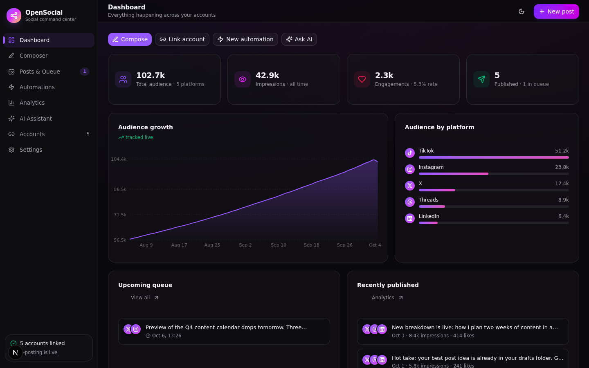
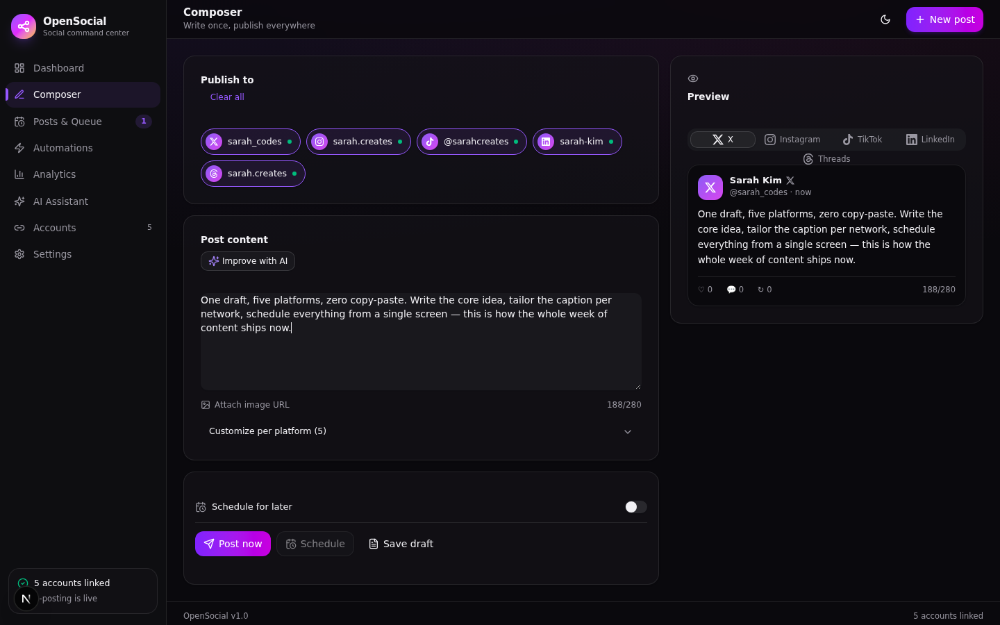
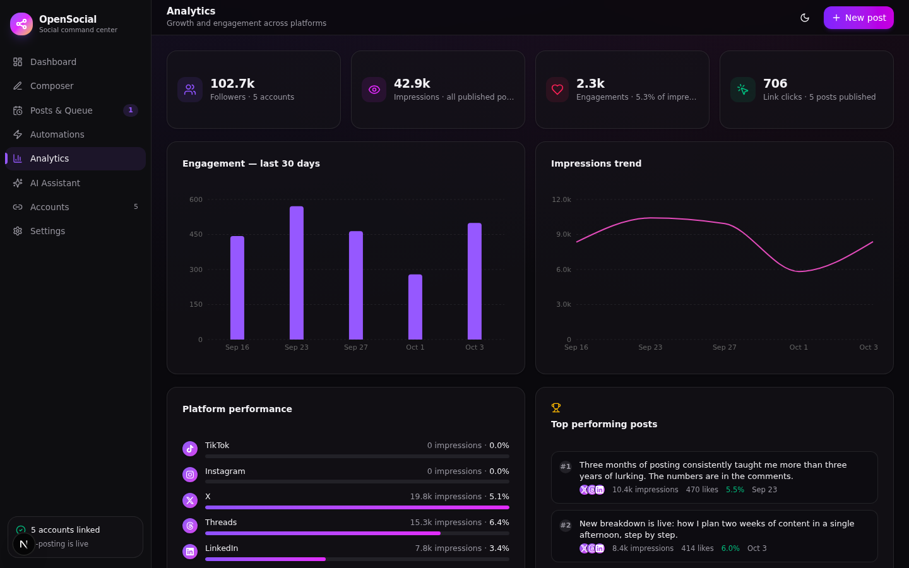
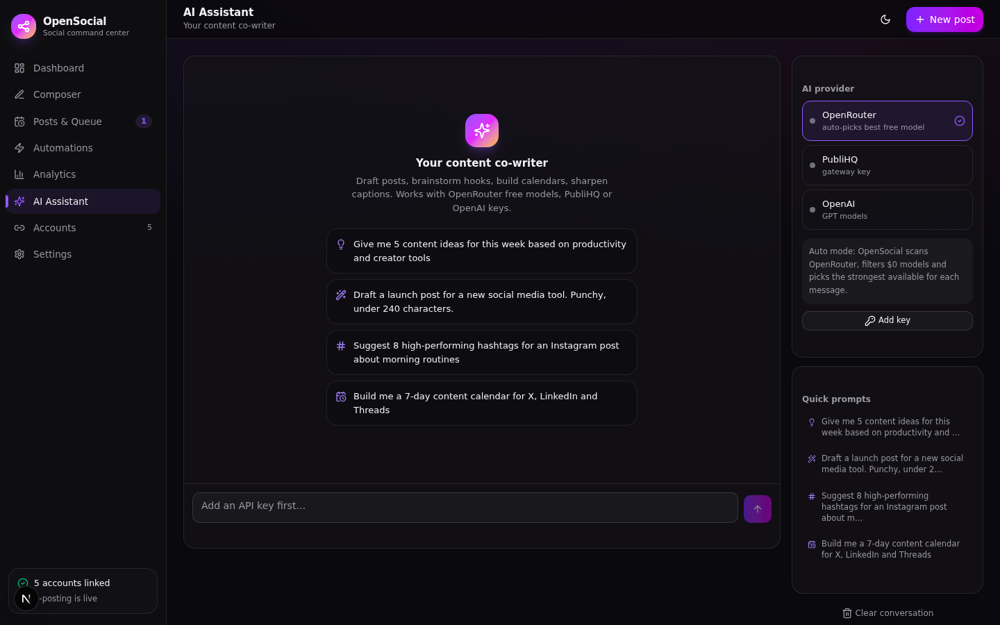
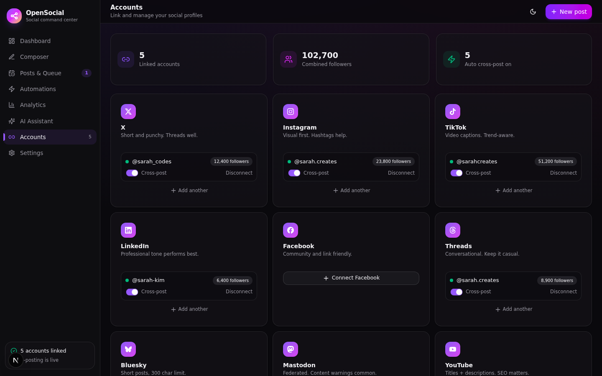
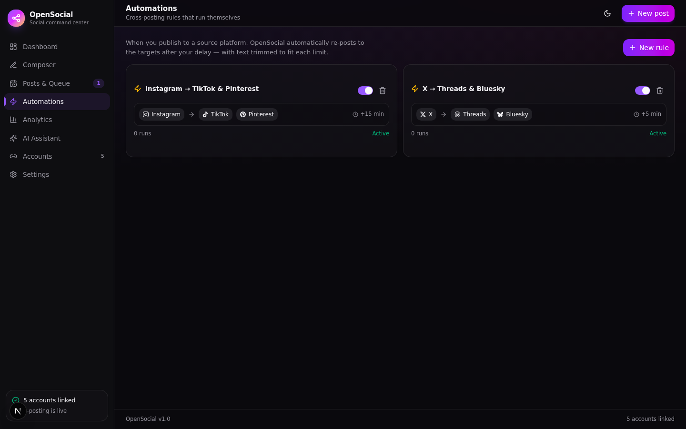

<div align="center">



# OpenSocial

**One composer, every platform.**

Link your social accounts, write once, publish everywhere — with automations, analytics and an AI co-writer built in.

[](https://nextjs.org)
[](https://www.typescriptlang.org)
[](https://www.prisma.io)
[](LICENSE)

</div>

---

## Why

Every creator knows the drill: the same post gets retyped five times across five tabs. OpenSocial collapses that into a single workspace — compose, tailor per platform, schedule or publish, and let automations handle the re-posting while analytics show what actually worked.

## Features

**Composer** — write once, publish to every linked account at once. Per-platform character limits are enforced live, each platform can get a customized variant of the text, image attachments by URL, plus a real-time preview that mimics how the post will look on X, Instagram, LinkedIn and friends. Publish immediately, schedule for later, or save a draft.

**Automations** — cross-posting rules that run themselves. "When I post to X → also post to Threads and Bluesky after 5 minutes." Text is trimmed to each platform's limit automatically, delays are configurable, and every rule tracks its own run count. A background worker publishes anything due.

**Analytics** — audience growth, engagement over time, impressions trend, per-platform performance with engagement rates, and a top-performing-posts leaderboard. Engagement numbers are pulled live from the platforms that expose them (Bluesky, Mastodon, X, Threads, Reddit) via **Sync live metrics**; the dashboard is empty until you bring data in, and nothing is generated for you.

**AI Assistant** — streaming chat that drafts posts, builds content calendars, suggests hashtags and sharpens hooks. One-click "send to composer" on any reply. Works with three providers:

| Provider | Model handling | Get a key |
|---|---|---|
| **OpenRouter** | **Auto** — scans all `$0` free models, picks the strongest available per message | [openrouter.ai/keys](https://openrouter.ai/keys) |
| **PubliHQ** | Gateway default model, streaming | [publihq.com](https://publihq.com) |
| **OpenAI** | `gpt-4o-mini` by default, streaming | [platform.openai.com](https://platform.openai.com/api-keys) |

**Accounts** — connect profiles across X, Instagram, TikTok, LinkedIn, Facebook, Threads, Bluesky, Mastodon, YouTube, Pinterest and Reddit. Every connection is verified live against the platform API before it's saved, real profile data and follower counts come straight from the source, and each account has its own cross-post toggle and re-sync button.

| | | |
|:---:|:---:|:---:|
|  |  |  |
| *Composer + live preview* | *Analytics* | *AI Assistant* |
|  |  | |
| *Account linking* | *Automations* | |

## Quick start

```bash
git clone https://github.com/your-username/opensocial.git
cd opensocial
cp .env.example .env
bun install          # or: npm install / pnpm install
bun run db:generate  # or: npx prisma generate
bun run db:push      # or: npx prisma db push
bun run dev          # or: npm run dev
```

Open [http://localhost:3000](http://localhost:3000). The workspace starts **completely empty** — no demo accounts, no sample posts, no invented numbers. A getting-started card walks you through the three steps: link an account, publish something, set up an automation.

> Want a clean slate later? **Settings → Clear workspace** wipes everything (AI keys are kept), or run `bun run db:reset`.

## Linking accounts

Connecting an account is a **live verification against the platform's own API** — nothing is stored until the platform confirms the credentials work. OpenSocial then pulls your real profile: handle, display name, follower count, profile URL. The number you see in the sidebar is the number the platform reported.

**One-click OAuth (1.1.0 "Handshake").** Mastodon needs nothing but your instance domain — OpenSocial registers itself on the instance on the fly and you authorize on the spot. Reddit and X take a one-time paste of your developer-app credentials (the exact redirect URI is shown and copyable in the dialog), after which connecting is a single click: the token exchange happens server-side and the account lands in your workspace, verified — no more manual refresh-token or access-token dances. Prefer the old way? Every OAuth platform still has a manual-credentials option.

Each platform defines what it needs:

| Platform | You provide | Publishing | Live metric sync |
|---|---|---|---|
| **Bluesky** | Handle + [app password](https://bsky.app/settings/app-passwords) | ✅ text + image | ✅ likes, replies, reposts |
| **Mastodon** | Just your instance (OAuth) — or an access token | ✅ text + image | ✅ favourites, boosts, replies |
| **X** | Your dev app's consumer keys (OAuth 1.0a) — or manual tokens | ✅ text + image | ✅ likes, replies, reposts, impressions\* |
| **Threads** | User ID + access token (Meta app) | ✅ text + image | ✅ likes, replies, quotes |
| **Reddit** | Your web-app client keys (OAuth) — or a refresh token + subreddit | ✅ text (self post) | ✅ score, comments |
| **LinkedIn** | Member token with `w_member_social` | ✅ text | — (restricted API) |
| **Facebook** | Page ID + page token | ✅ text / photo | — |
| **Instagram** | Business user ID + token | ✅ image required | — |
| **Pinterest** | Token + board ID | ✅ pin (image required) | — |
| **YouTube** | OAuth token | — (no text-post API) | channel + subscriber sync |
| **TikTok** | Token | — (audited Direct Post only) | profile + follower sync |

\* subject to your X API tier.

Every connector lives in `src/lib/adapters/` — one file per platform, plain `fetch`, zero external dependencies. X posts are signed with real OAuth 1.0a HMAC-SHA1; Reddit exchanges its refresh token for a fresh access token on every call; Threads and Instagram go through the two-step container → publish flow with status polling.

**When delivery fails, it says so.** A target that the platform rejects is marked failed with the platform's actual error message, the post moves to the retryable state, and accounts whose tokens expire get flagged `expired` in Accounts. Metrics sync on demand (**Analytics → Sync live metrics**, or the per-account refresh button) pulls only what each API actually exposes — the rest stays empty instead of being invented.

> Tokens and secrets are stored server-side in your own SQLite database and are never returned to the browser — the UI shows masked previews only. For platforms above marked "your dev app", you create a free developer app on that platform and paste its credentials; no OpenSocial service sits in the middle.

## AI keys

Keys are added in-app (**Settings → AI providers** or the panel in the AI Assistant), stored server-side in the database, masked everywhere in the UI, and never returned in full to the browser. The chat endpoint streams SSE end-to-end.

The OpenRouter auto-pick logic (`src/lib/ai.ts`) fetches the model catalog, filters models where prompt and completion pricing are both `0`, prefers a curated list (DeepSeek V3, Llama 3.3 70B, Gemini Flash, Qwen 2.5 72B …), falls back to the highest-context free model, and caches the choice for 10 minutes. The resolved model id is returned in the `X-OS-Model` response header and shown under each conversation.

## Stack & structure

Next.js 16 (App Router) · TypeScript · Tailwind CSS 4 · shadcn/ui · Prisma + SQLite · Recharts · Zustand · next-themes

```
src/
├── app/
│   ├── api/
│   │   ├── accounts/        # live-verified connect / disconnect / sync
│   │   ├── posts/           # CRUD + publish + due-post worker
│   │   ├── automations/     # cross-posting rules
│   │   ├── analytics/       # aggregated metrics
│   │   ├── metrics/sync/    # live engagement pull from platform APIs
│   │   ├── ai/chat/         # streaming SSE proxy to providers
│   │   ├── ai/models/       # OpenRouter free-model catalog
│   │   ├── settings/        # API key storage (masked)
│   │   ├── reset/           # wipe workspace data
│   │   └── chat/history/    # persisted conversations
│   └── page.tsx             # single-page app shell
├── components/opensocial/   # one file per view + shell
└── lib/
    ├── adapters/            # real platform connectors (one per network)
    ├── ai.ts                # provider routing + free-model picker
    ├── publisher.ts         # real delivery engine + automation firing
    ├── platforms.ts         # platform metadata, limits, credential specs
    └── store.ts             # client state
prisma/schema.prisma         # 7 models
docs/screenshots/            # what you saw above
```

## Scripts

| Command | What it does |
|---|---|
| `bun run dev` | Dev server on port 3000 |
| `bun run build` / `bun run start` | Production build & serve |
| `bun run db:push` | Apply schema to the database |
| `bun run db:generate` | Regenerate the Prisma client |
| `bun run lint` | ESLint |
| `bun run pack` | Bundle the project into `opensocial.zip` (needs the `zip` CLI) |
| `bun run db:reset` | Wipe accounts, posts, automations, chat and keys |

## Roadmap

- [ ] Native media library with per-platform crop presets
- [ ] Queued calendar drag-and-drop
- [ ] Comment inbox across platforms
- [ ] Multi-user workspaces

## FAQ

**Is the posting real?** Yes. Every publish is a real HTTP call to the platform's API with credentials you supply, and Bluesky and Mastodon work end-to-end with nothing more than an app password / access token. Outcomes are honest: published targets store the platform's post ID and permalink, rejected targets store the platform's error text, and engagement numbers only ever come from the platforms themselves — never generated.

**Why do X / LinkedIn / Meta platforms need my own developer credentials?** Those APIs require a registered application with your account as the owner. You create a free app on the platform's developer portal, paste its keys/tokens into OpenSocial, and the app talks to the API directly — nothing is proxied through a third-party service.

**Where are my API keys stored?** In your local SQLite database (`db/custom.db`), server-side only. The browser only ever receives a masked preview. The database file is gitignored — never commit it or copy it into a repo.

**Which AI provider should I pick?** OpenRouter — the auto free-model routing costs nothing to try.

---

Built with Next.js 16. Licensed under [MIT](LICENSE).
